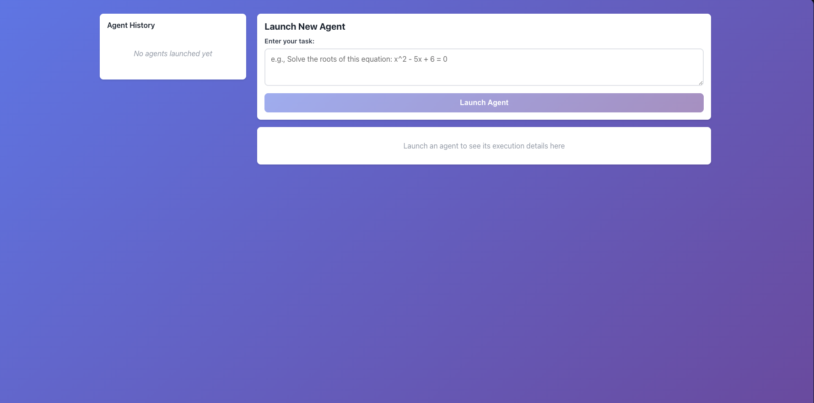
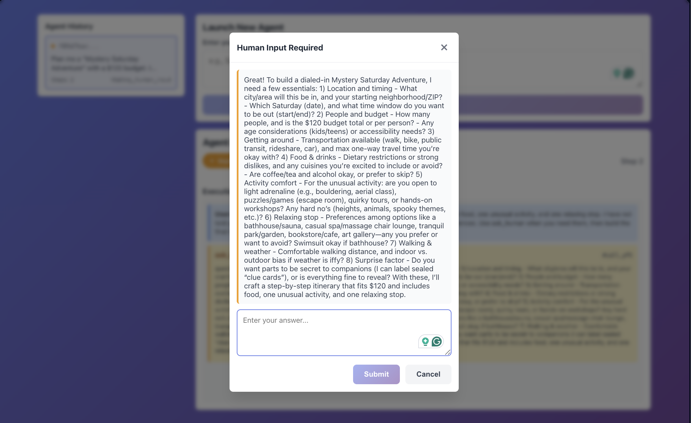
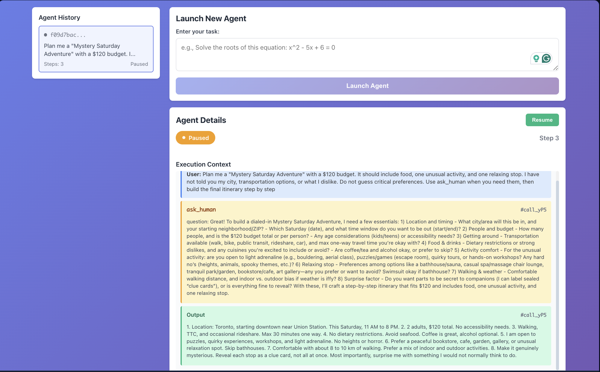

# Agent Meets the Real World

A complete agent run through the web interface, including human input, execution, pause, resume, and completion.

### 1. Launch the Agent

### 2. Human in the Loop

### 3. Agent Execution

### 4. Pause Execution

### 5. Resume and Complete

