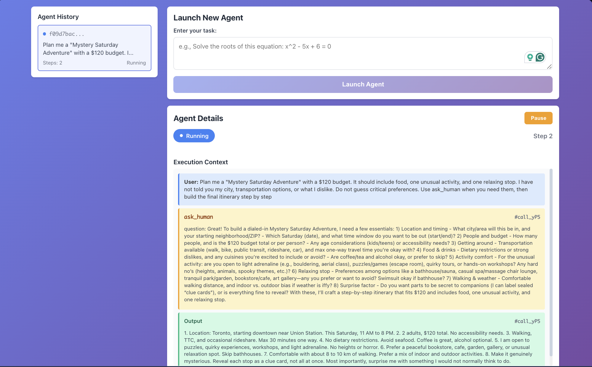
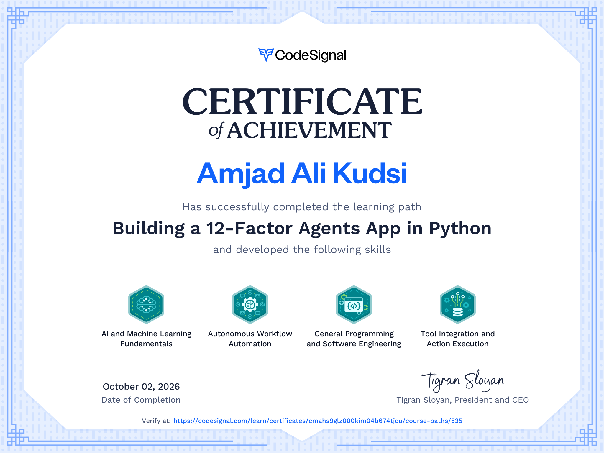

# Building a 12-Factor Agents App in Python
This repository documents my hands-on work through the 12-Factor Agents methodology, focused on building reliable and maintainable AI agent systems in Python.

The projects progress from structured LLM outputs and tool use to explicit agent loops, stateless architecture, persistent execution state, REST APIs, background workflows, and human-in-the-loop controls such as pause and resume.

**Core skills and technologies:** Python, LLM tool calling, structured outputs, agent state management, REST APIs, database persistence, background execution, and human-in-the-loop agent workflows.

# Agent Execution

# Completion Certificate

